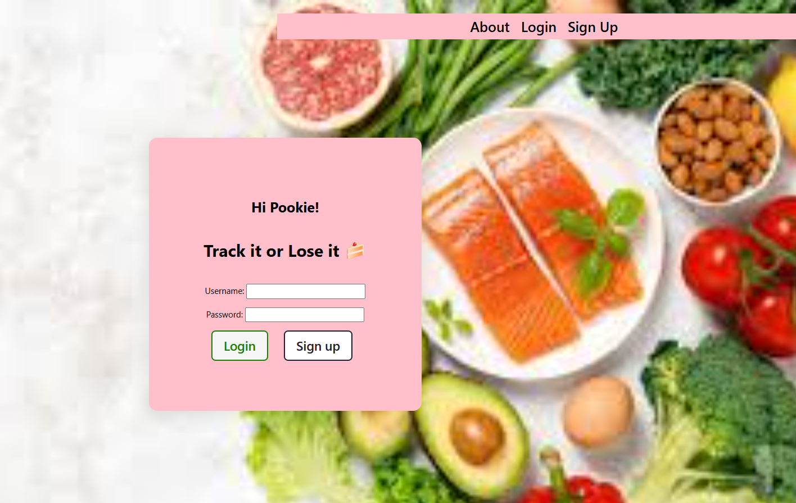
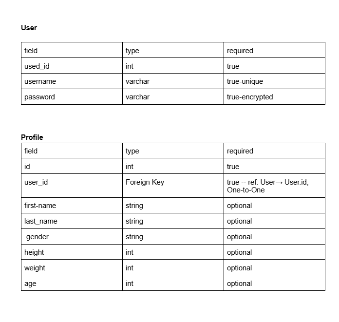
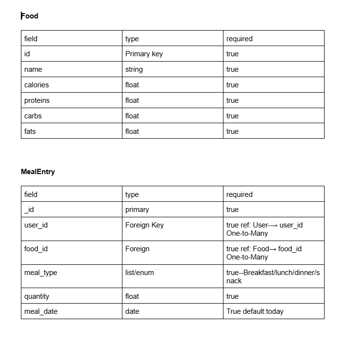
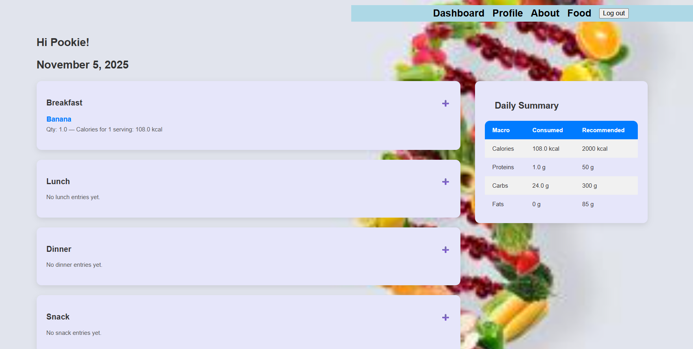
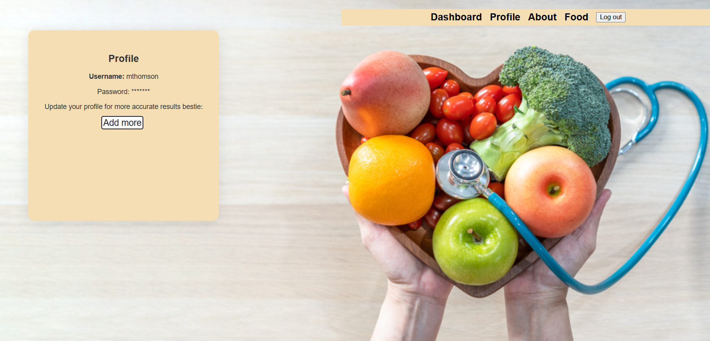
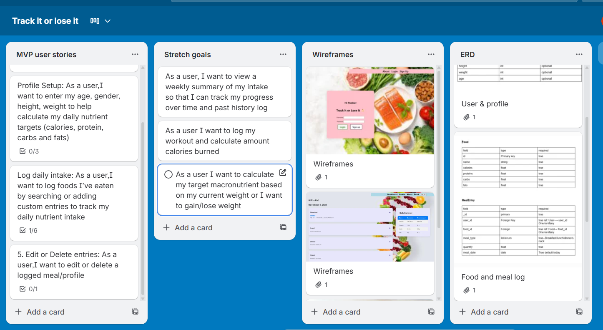

# Track it or Lose it 
Track it or lose it is your diet diary. This app helps you maintain a healthy diet by monitoring the amount of calories/macronutrients you consume daily. Simply enter your meal content and we'll tell you many calories, carbs, proteins and fats you have consumed. We can also give you a personal estimate of the daily recommended calories/macronutrients based on a few factors such as your age, weight, and gender and suggest a recommended diet for those who are looking to lose or gain a few pounds.

      
## MVP Stories:
User Authentication:As a user,I want to create an account with my username and password to save my nutrition data.

As a user, after I log in/create a profile, I would like to see a page to log my daily intake based of each meal type. I want to look up foods or enter new food if it doesn't exist

Profile Setup: As a user,I want to enter my age, gender, height, weight to help calculate my daily nutrient targets (calories, protein, carbs and fats)

Edit or Delete entries: As a user,I want to edit or delete a logged meal/profile

As a user I want to log out.

## ERD

 > ## Wireframes

> ## Next steps
I want users to view  a weekly summary and past history tab. I want users to be able to log workouts  and calculate target calories/macronutrients based on factors such as age and height, etc.. and be able to modify target based on desired weight

 > ## Technologies used
For this project I used HTML, Javascript and CSS, Django, postgresql, Python, Trello 

